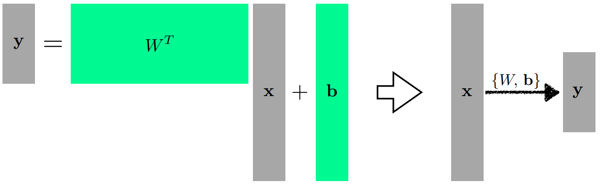

## 딥러닝의 중요 요소
- 학습을 시킬 `데이터(Data)`
- 학습할 `모델(Model)`
- 학습시키기 위한 `손실 함수(Loss)`
- 손실을 최소화하는 `최적화 알고리즘(Optimization Algorithm)`

<!---

## Neural Networks
- 뇌, 포유류의 신경망
- 뉴런에서 영감을 받아 애매하게 영향을 받은 컴퓨팅 시스템
- 인간의 뇌에서 역전파가 일어나는가? 그렇다고 얘기할 수는 없다.
    -> 사람의 지능을 모방하는 방법론이라고 할 수는 없다.
- 하지만, 굳이 날기 위해 새를 닮을 필요는 없듯이, 지능을 모방하기 위해 뇌를 닮을 필요는 없다..!(개인적으로 인상깊은 비유)
- 비선형 연산이 반복적으로 일어나면서 함수를 근사하는 모델이 더 맞는 말인 듯.
- 수많은 파라미터를 통한 function approximator라고 생각하는게 나도 좋아하는 비유!
- 하지만 개인적인 생각으론, transformer가 신경망과 너무 다른 형태처럼 느껴지기 때문에 이렇게 생각하는게 아닌가? 싶기도 하다.
- 알고리즘으로 만들어낸 이 근사 함수를 우리의 뇌에요!! 라고 이야기하고 싶지 않아서(실제로도 형태가 많이 다르기도 해서) 무의식적으로 인정할 수 없어서 저 표현이 더 편한 것 일지도...?
- 너무 감성적인 생각인 것 같기도 하다 ㅋㅋㅋ
- 아무튼, `Neural Network 가 왜 잘되냐?` 라는 질문에 `인간의 뇌를 본땄기 때문에 잘돼`라는 답변은 별로 좋은 답변은 아니라고 생각한다.
- 뉴럴 네트워크의 표현력이 아주 크기 때문이다! 라는 답변이 좋을 듯!

--->

## 여러 차원의 벡터 공간과 선형 변환
- 세상이 선형으로만 이루어져있지 않다. 1차원에서 1차원으로 가는 변환만을 찾지 않는다.
- `N차원`에서 `M차원`으로 가는 모델을 찾고 싶을 수 있다.
- 행렬을 이용해 N차원에서 M차원으로 가는 mapping을 정의(affine transform)
- y = WTx + b (W와 b는 행렬과 벡터)
- `행렬을 곱한다` == `두 vector space간의 변환`
- 선형성을 가지는 변환이 있을 때, 그 변환은 항상 행렬로 표현된다
- `행렬을 찾겠다` == `두 다른 차원 사이에 선형 변환을 찾겠다` 

 
x와 y. 다른 차원의 두 벡터를 W 행렬을 통해 변환시켰다.

 

## Activation Function의 사용
- 핵심은, 모델이 최대한 `많은 상황을 표현`하도록 하는 것이다
- `네트워크를 깊게`(deep) 쌓으려면?
    - 중간에 `hidden vector들을 획득 후 목표 벡터를 획득`하는 방법이 있다
    - 단, 이는 `단순히 행렬들의 곱(선형 결합)에 불과`하다
    - 선형 결합은, `아무리 깊어져도 한단짜리와 표현력이 같다`
    - 즉, 단순한 선형 결합(linear transform)으로는 한계를 가진다
- mapping이 표현할 수 있는 `표현력을 극대화`하기 위해서는?
    - `비선형 결합`(nonlinear transform)을 활용한다
    - 비선형 결합을 거친 후의 선형 변환을 n번 반복하여 더 많은 표현력을 얻을 수 있다
- 어떤 Activation Function이 제일 좋은가?
    - 사실, 어떤게 제일 좋을 지는 모른다.
    - 문제마다 다르고, 상황마다 다르다.
    - 각 활성 함수의 특징을 이해하고 문제에 활용하는 것이 좋다.

## Loss Function에 대하여
- 입력이 주어졌을 때 출력값과, 목표의 차이를 정의
- 이를 최소화하는 것이 목표
- 이것이 항상 우리의 목적을 완성하지는 않는다
    - 항상 도움이 되지는 않을 수도 있다.
    - MSE가 선형 회귀에서 최적인가?
        - 제곱이 아니라 절댓값이나 네제곱을 활용해도 목표를 0으로 만드는 것은 같다.
        - 하지만, outlier가 있을 경우 큰 영향을 받게 된다.
        - 이렇듯, 어떻게 활용하는가에 따라 성질이 조금 달라진다.
    - cross entropy가 분류 문제 해결에 최적인가? 
        - 분류를 잘 하는 관점에서는 결국 다른 값들 대비 높기만 하면 되는데? 
        - 다만 이를 수학적으로 표현하기 까다로우니 활용하는 것일 뿐.
    - 확실하지 않은 확률 정보(uncertanty)를 같이 찾고 싶을 때는?
        - probalistic loss function을 활용하여 likelihood를 최대화 하는 방향으로..
- 이게 `왜 우리가 원하는 결과를 얻어낼 수 있는지`? 에 대한 이야기를 할 수 있어야 한다
- loss function이 어떤 의미를 가지고 있는지 생각하자

